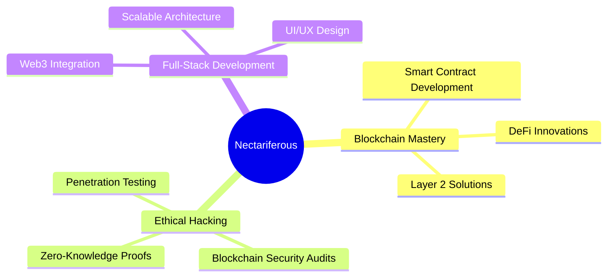

<div align="center">


[](https://git.io/typing-svg)

</div>

## 🧬 Core Skills

<div align="center">


</div>

## 🚀 Featured Projects

<div align="center">

[](https://github.com/nectariferous/MAGAZ)
[](https://github.com/nectariferous/hyip-investment-platform)
[](https://github.com/nectariferous/Wishpernet)

</div>


## 📊 GitHub Analytics

<div align="center">
  
  
</div>

## 🌠 Aspirations



## 🛡️ Blockchain Security Focus

| Area | Skills |
|------|--------|
| Smart Contract Auditing | Vulnerability Assessment, Best Practices Implementation |
| DeFi Security | Liquidity Pool Analysis, Flash Loan Attack Prevention |
| Wallet Security | Key Management, Hardware Wallet Integration |
| Network Security | Node Hardening, Consensus Mechanism Analysis |

## 🤝 Connect & Collaborate

<div align="center">

[](https://github.com/nectariferous)
[](https://t.me/nectariferous)

</div>

## 💖 Support My Work

If you find value in my projects or want to support my learning journey:

```
ETH: 0x3A06322e9F1124F6B2de8F343D4FDce4D1009869
```

<div align="center">


</div>
