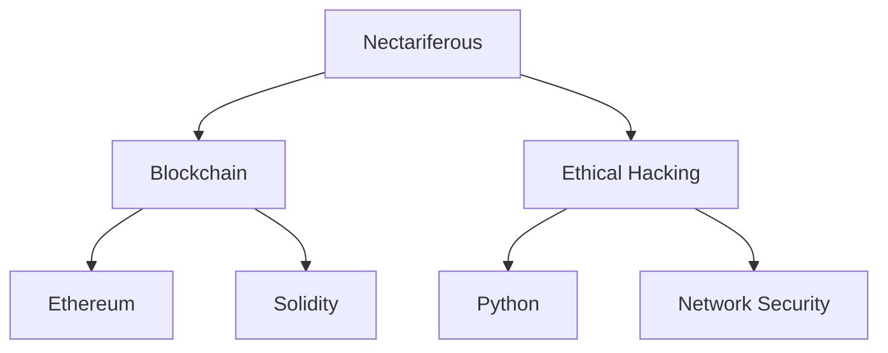

 

 

 

<table align="center">
  <tr>
    <td align="center" width="140">
      
       Project 1
    </td>
    <td align="center" width="140">
      
       Project 2
    </td>
    <td align="center" width="140">
      
       Project 3
    </td>
  </tr>
</table>

 

 

