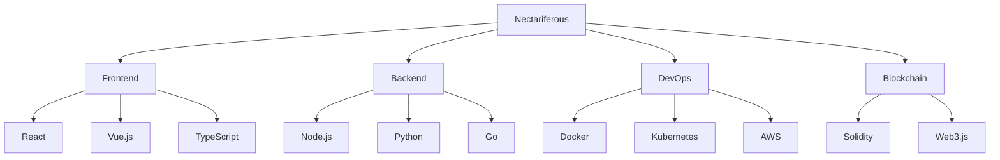

<div align="center">


</div>

## Tech Stack



## Featured Projects

[](https://github.com/nectariferous/MAGAZ)
[](https://github.com/nectariferous/hyip-investment-platform)

## Connect

[](https://t.me/nectariferous)
[](https://github.com/nectariferous)

## Support

```javascript
const donationAddress = "0x3A06322e9F1124F6B2de8F343D4FDce4D1009869";
```

[](https://github.com/sponsors/nectariferous)

<div align="center">


</div>
