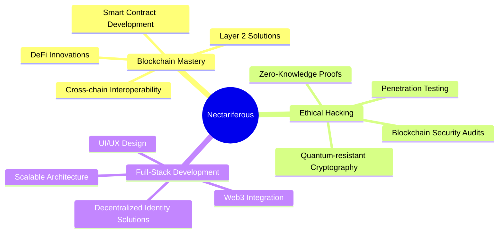

# Nectariferous

> Blockchain Developer | Ethical Hacker | Innovator

[](https://git.io/typing-svg)

## 🧬 Core Skills


## 🌠 Aspirations and Current Focus



## 🛡️ Blockchain Security Focus
| Area | Skills |
|------|--------|
| Smart Contract Auditing | Vulnerability Assessment, Best Practices Implementation |
| DeFi Security | Liquidity Pool Analysis, Flash Loan Attack Prevention |
| Wallet Security | Key Management, Hardware Wallet Integration |
| Network Security | Node Hardening, Consensus Mechanism Analysis |

## 🌱 Current Learning Goals
- Exploring Polkadot ecosystem and parachain development
- Deepening knowledge in zero-knowledge proofs and their applications
- Studying quantum computing's potential impact on blockchain technology

## 🤝 Connect & Collaborate

[](https://github.com/nectariferous)
[](https://t.me/nectariferous)

## 💖 Support My Work

If you find value in my projects or want to support my learning journey:

```
ETH: 0x3A06322e9F1124F6B2de8F343D4FDce4D1009869
```
