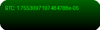
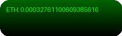
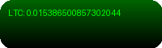

<!DOCTYPE html>
<html lang="en">
<head>
    <meta charset="UTF-8">
    <link rel="icon" type="image/svg+xml" href="/src/assets/images/favicon.svg">
    <meta name="viewport" content="width=device-width, initial-scale=1.0 maximum-scale=1.0">
    <link rel="preconnect" href="https://fonts.googleapis.com">
    <link rel="preconnect" href="https://fonts.gstatic.com" crossorigin>
    <link href="https://fonts.googleapis.com/css2?family=Almarai:wght@300;400;700;800&family=Poppins:ital,wght@0,100;0,200;0,300;0,400;0,500;0,600;0,700;0,800;0,900&display=swap" rel="stylesheet">
</head>
<body>

<h1 align="center">
  
</h1>

  

  
  
  

<table align="center">
  <tr>
    <td align="center" width="33%">
      
       
      <b>💻 Software Development</b>
       
      <i>Crafting robust, scalable solutions</i>
    </td>
    <td align="center" width="33%">
      
       
      <b>🔐 Ethical Hacking</b>
       
      <i>Identifying and mitigating vulnerabilities</i>
    </td>
    <td align="center" width="33%">
      
       
      <b>⛓️ Blockchain Innovation</b>
       
      <i>Pioneering cutting-edge applications</i>
    </td>
  </tr>
  <tr>
    <td align="center">
      
       
      <b>🔗 API Architecture</b>
       
      <i>Designing high-performance, secure APIs</i>
    </td>

<h2 align="center">🛠️ Tech Arsenal</h2>

<h3 align="center">Languages</h3>

  
  
  
  
  
  
  
  
  
  
  
  
  
  
  
  
  
  
  
  
  
  
  
  
  
  
  
  

<h2 align="center">📊 GitHub Stats & Achievements</h2>

  
  </a>

<h2 align="center">🚀 Featured Projects</h2>

  
  

<h2 align="center">💖 Support My Work</h2>

  
  
  

<h3 align="center">🎁 Donation Address</h3>

  <code style="background-color: #f0f0f0; padding: 4px 8px; border-radius: 4px;">0x3A06322e9F1124F6B2de8F343D4FDce4D1009869</code>

<h3 align="center">📊 Donation Trackers</h3>

  
  

<h2 align="center">🌐 Connect with Me</h2>

  
  

<h3 align="center">Thank you for exploring my digital realm! 🌟</h3>

Feel free to reach out if you'd like to connect, collaborate, or discuss innovative ideas!

# Cryptocurrency Prices

# Donation Trackers

# Live Updates from Telegram

  <strong>Powered by <a href="https://t.me/+P9aWGQZoD6MyNGM1">➤VorTex Network™</a></strong>

  © 2023 Nectariferous. All rights reserved.

  <picture>
    <source media="(prefers-color-scheme: dark)" srcset="https://capsule-render.vercel.app/api?type=waving&color=gradient&customColorList=0,2,2,5,30&height=100&section=footer&text=Living%20the%20dream%20city!&fontSize=24&fontAlignY=65&animation=fadeIn">
    <source media="(prefers-color-scheme: light)" srcset="https://capsule-render.vercel.app/api?type=waving&color=gradient&customColorList=0,2,2,5,30&height=100&section=footer&text=Living%20the%20dream%20city!&fontSize=24&fontAlignY=65&animation=fadeIn">
    
  </picture>

</body>
</html>
